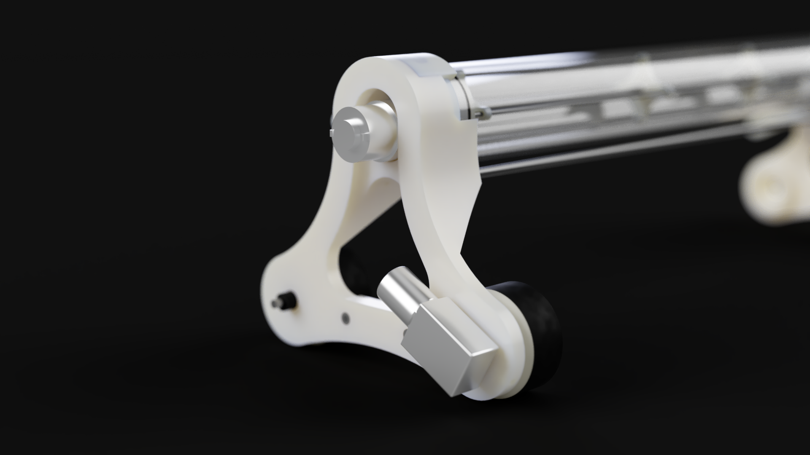

# Dustin-3000

> This project is archived and no longer actively developed — it's public as a portfolio piece.

**Dustin-3000** is a small robot that spreads shuffleboard sand (the fine powder players sprinkle on the table to control puck glide) evenly across the playing surface. Instead of dusting the table by hand, you drive Dustin-3000 along it over Bluetooth and it lays down a consistent layer of sand as it goes.

The firmware is written in C++ for an Arduino Mega (ATmega2560) and drives three closed-loop DC motors, reads onboard sensors, and takes commands from a phone over a Bluetooth serial link.

## How it works

Dustin-3000 is a two-wheeled differential-drive platform with a third "agitator" motor that meters sand out of a hopper:

- **Two drive motors** (port and starboard) move and steer the robot — driving them at equal speeds goes straight, driving them differentially turns.
- **One agitator motor** stirs the hopper so sand falls onto the table at a controlled rate.
- **Spreading** is simply the two behaviours at once: drive forward while the agitator runs, leaving an even trail of sand behind.

You control it from a Bluetooth terminal/app, sending short text commands. The robot streams status (battery level, low-voltage warnings) back over the same link.

### Control architecture

The interesting part is that all of this runs concurrently on a single microcontroller with no operating system. The firmware uses a lightweight **cooperative scheduler**: a hardware timer interrupt (`TimerThree`) fires every 50 ms and ticks a set of `Thread` objects, each of which runs at its own interval. This keeps motor control, Bluetooth, and battery monitoring responsive without blocking each other.

Each subsystem is modelled as its own class:

| Component | Responsibility |
|-----------|----------------|
| `MotorThread` | Closed-loop speed control for one motor — reads a quadrature **encoder**, computes shaft RPM, and runs a **PID** loop that adjusts PWM to hold a target speed. Three instances: port drive, starboard drive, agitator. |
| `BatteryThread` | Samples pack voltage through a voltage divider on an analog pin and emits low-voltage warnings over Bluetooth so the LiPo isn't over-discharged. |
| `SonarThread` | Reads ultrasonic distance sensors (averaged over several pings) — intended for edge/obstacle detection. |
| `checkBT` | Parses incoming Bluetooth commands and translates them into motor setpoints. |

### Closed-loop motor control

Each motor doesn't just get a raw PWM value — it gets a *target speed*. The `MotorThread` reads the motor's encoder, converts encoder ticks into actual shaft RPM (accounting for the gearbox ratio and encoder resolution), and feeds the error between target and actual speed into a PID controller. The PID output is the PWM duty cycle and direction sent to the motor driver. This means the robot moves at a consistent speed regardless of battery sag, friction, or load — important for laying sand down evenly.

### Bluetooth command set

Commands are sent as plain text over the Bluetooth serial port. The core set:

| Command | Action |
|---------|--------|
| `F` / `B` | Drive forward / backward (optionally `F<speed>` to set speed) |
| `stop` | Stop all motors |
| `dispense` | Run the agitator only (drop sand in place) |
| `spread` | Drive forward *and* run the agitator (the main task) |
| `bat` | Report current battery voltage |

## Repository layout

The project began as a series of focused hardware bring-up sketches before the subsystems were combined into the main firmware. Each Arduino sketch lives in its own folder:

- **`Main_Test/`** — the complete robot firmware (scheduler, motors, PID, Bluetooth, battery). `Main_Test/Main_Test_2/` is a later revision with differential (tank) steering, variable-speed commands, and queued command parsing.
- **`PID_Test/`** — bench-tuning a single motor's PID loop.
- **`Test_Encoder/`** — verifying quadrature encoder counting.
- **`Test_Motor_Driver/`** — interactive menu for exercising the HG7881 motor driver.
- **`Radar_Test/`** — ultrasonic distance sensor timing.
- **`Accel_Gyro_Test/`** — reading the MPU-6050 accelerometer/gyro over I²C.
- **`AT_BT/`** & **`PID_Test/BT_Test/`** — configuring and testing the Bluetooth module.
- **`Renders/`** — CAD renders of the mechanical assembly.

## Hardware

- Arduino Mega 2560 (chosen for its multiple hardware serial ports and abundant interrupt-capable pins)
- 3× brushed DC gear motors with quadrature encoders
- HG7881 dual H-bridge motor driver
- HC-05/06 Bluetooth-to-serial module
- HC-SR04 ultrasonic sensors
- MPU-6050 IMU (accelerometer + gyroscope)
- LiPo battery with a resistor voltage divider for monitoring
